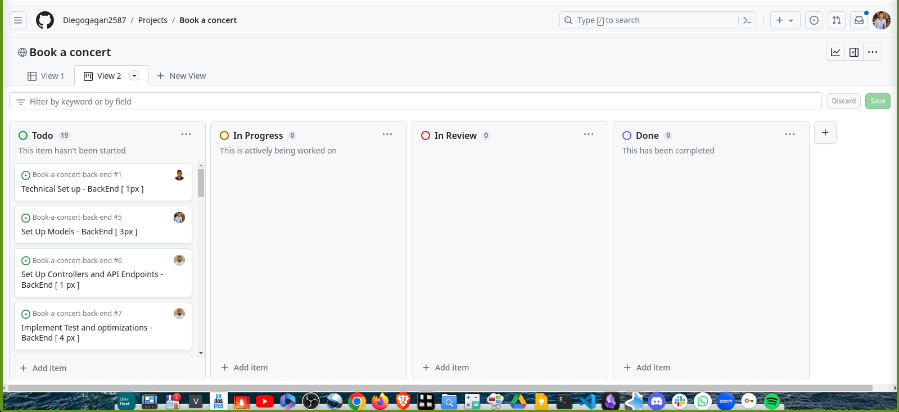

<a name="readme-top"></a>

<div align="center">

# BOOK A CONCERT APP


</div>

<!-- TABLE OF CONTENTS -->

# Table of Contents

- [Book a Concert App](#--book-a-concert-)
- [Kanban Board](#kanban-board)
- [Built With ](#-built-with-)
   - [Tech Stack ](#tech-stack-)
    - [Key Features ](#key-features-)
- [Getting Started ](#-getting-started-)
   - [Prerequisites](#prerequisites)
    - [Setup](#setup)
    - [Install](#install)
    - [Usage](#usage)
    - [Run tests](#run-tests)
- [Authors ](#-authors-)
- [Acknowledgements ](#-acknowledgements-)
- [Future Features](#-future-features)
- [Contributing](#-contributing-)
- [Show your support ](#️-show-your-support-)
- [FAQ (OPTIONAL) ](#-faq-optional-)
- [License ](#-license-)


<!-- PROJECT DESCRIPTION -->

# Book a Concert App <a name="--book-a-concert-"></a>

**Book a Concert App** Final Capstone Project, based on an app to book an appointment to a concert. This App will use Rails for the backend API and React for the frontend

### Kanban Board <a id="kanban-board">
- Take a look to the [Project Kanban Board](https://github.com/users/Diegogagan2587/projects/4/views/2)
- Final number of team members: 3
- Kanban Initial state below:

<div align="center">
    
</div>


## Built With <a name="built-with"></a>
- Ruby on Rails
- Postgres
- React & Redux
- Tailwind

### Tech Stack <a name="tech-stack"></a>

<details>
  <summary>Client</summary>
  <ul>
    <li><a href="#">React</a></li>
  </ul>
</details>

<details>
  <summary>Server</summary>
  <ul>
    <li><a href="#">Rails</a></li>
  </ul>
</details>


<!-- Features -->

### Key Features <a name="key-features"></a>
- **RESTful API**
- **Log-in and Signup without using devise**
- **Responsive design**


<p align="right">(<a href="#readme-top">back to top</a>)</p>


<!-- GETTING STARTED -->

## Getting Started <a name="getting-started"></a>
To get a local copy up and running, follow these steps.

### Prerequisites
Before you proceed, ensure that you have the following installed on your machine:
- Git
- Node
- Ruby
- Rails
- Postgres
- Postman

### Setup
Clone this repository to your desired folder:

```sh
  git clone git@github.com:Diegogagan2587/Book-a-concert-back-end.git
  cd Book-a-concert-back-end
```

### Install

Install the project dependencies with:

```sh
  bundle install
  rails db:drop
  rails db:create
  rails db:schema:dump
  rails db:migrate
```

### Usage

To run the project, execute the following command:

```sh 
  rails server
```

### Run tests

To run tests, run the following command:
```sh
  rspec
```
- Open your web browser and visit http://127.0.0.1:3000
- You should now see the main view of Rails page.
- You can interact with the backend API using Postman and following this [documentation](https://documenter.getpostman.com/view/31013872/2s9YXk3Lv4)


<p align="right">(<a href="#readme-top">back to top</a>)</p>

<!-- AUTHORS -->

## Authors <a name="authors"></a>

**Rudi Carrillo**

- GitHub: [@rudicarrilloypr](https://github.com/rudicarrilloypr)
- Twitter: [@__rudicarrillo](https://twitter.com/__rudicarrillo)
- LinkedIn: [Rudi Carrillo](https://www.linkedin.com/in/rudi-carrillo/)
- Instagram: [@__rudicarrillo](https://www.instagram.com/_rudicarrillo/)

**Dievo Vidal Lopez**

- GitHub: [@Diegogagan2587](https://github.com/Diegogagan2587)
- Twitter: [@dieg02587](https://twitter.com/dieg02587)
- LinkedIn: [Diego Vidal Lopez](https://www.linkedin.com/in/diego-vidal2587/)

**Dani Morillo**

- GitHub: [@danifromecuador](https://github.com/danifromecuador)
- Twitter: [@danifromecuador](https://twitter.com/danimorilloc)
- LinkedIn: [danielfromecuador](https://www.linkedin.com/in/danifromec)

<p align="right">(<a href="#readme-top">back to top</a>)</p>

## Acknowledgements <a name="acknowledgements"></a>

I'd like to express my gratitude to everyone who made this project possible.

Thanks again to everyone who believed in this project and helped make it a reality!

Furthermore, special recognition is due to the [author](https://www.behance.net/muratk) of this [design](https://www.behance.net/gallery/26425031/Vespa-Responsive-Redesign) that served as inspiration for our work


<!--- Future Features ---->

## <a href="#future-features"></a>Future Features
- Improve UI design
- Add profile picture
- Add Bio to each profile
- Improve user log in and signup security
<p align="right">(<a href="#readme-top">back to top</a>)</p>


<!-- CONTRIBUTING -->

## Contributing <a name="contributing"></a>

Contributions are welcome! If you find any bugs or want to enhance the project with new features, please follow these steps:

1. Fork the repository.
2. Create a new branch for your feature or bug fix.
3. Make the necessary changes and commit them.
4. Push your changes to your forked repository.
5. Submit a pull request describing your changes.

Feel free to check the [issues page](https://github.com/Diegogagan2587/Book-a-concert-back-end/issues).

<p align="right">(<a href="#readme-top">back to top</a>)</p>

<!-- SUPPORT -->

## Show your support <a name="support"></a>

If you like this project, please consider supporting us! Your support helps us to continue developing and improving our project for everyone to enjoy. Whether it's a small donation, sharing the project with your friends, or contributing your skills and expertise, every little bit makes a huge difference. With your support, we can create something truly amazing together. Thank you for being a part of our community and helping us to make a difference!

<p align="right">(<a href="#readme-top">back to top</a>)</p>

<!-- FAQ -->

## FAQ <a name="faq"></a>
- **How do I set up the project?**

  - Clone the repository from GitHub, and see the [Setup](#setup) section above for details.

- **How can I contribute to the project?**

  1. Fork the repository on GitHub.
  2. Create a new branch for your changes using git checkout -b my-feature-branch.
  3. Make your changes and commit them with descriptive commit messages.
  4. Push your changes to your forked repository.
  5. Submit a pull request to the original repository.
  6. Wait for feedback and iterate on your changes as needed.

<p align="right">(<a href="#readme-top">back to top</a>)</p>

<!-- LICENSE -->

## License <a name="license"></a>

This project is [MIT](./MIT.md) licensed.

<p align="right">(<a href="#readme-top">back to top</a>)</p>